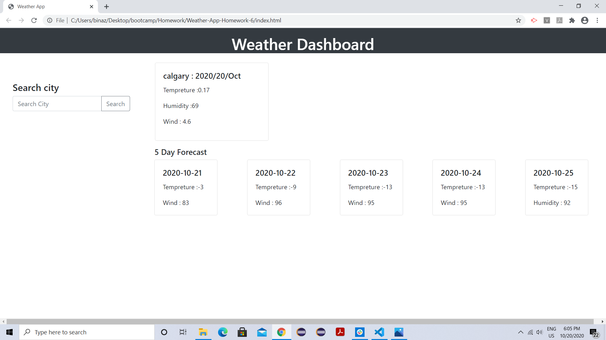
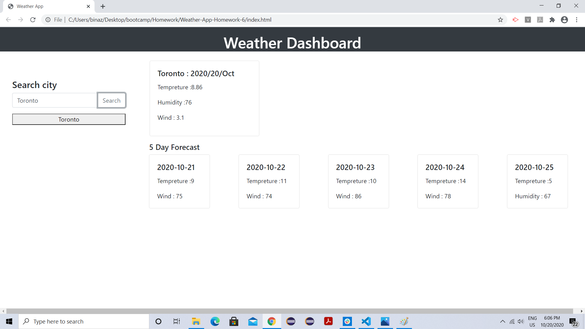
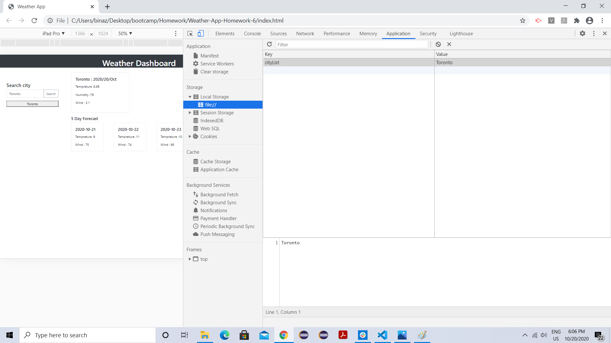

# Weather-App-Homework-6
This is a weather application which helps user to get weather forecast for today and 5 days in future.  In current day's weather it displays date, tempreture, humidity and wind speed. In 5 day future weather it displays date, tempreture and humidity. When a user search for city then it will give current day's weather and 5 day forecast and city will be added to search histoy. Then if user click on city in search history then again current and 5 day weather forcast will be present.

# API used.
[OpenWeather API](https://openweathermap.org/api)

# Images

# Git Hub
Repo Link : https://github.com/karimkapadia/Weather-App-Homework-6
Live Link : 
